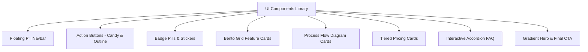
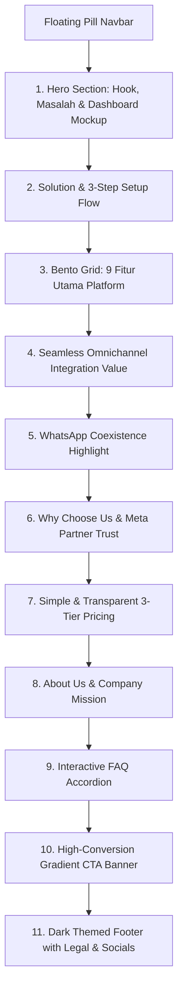

# Design System & Homepage Architecture: Kirim.chat

Dokumen ini merangkum hasil analisis mendalam terhadap desain antarmuka (*UI/UX Design*), arsitektur halaman depan (*Homepage Landing Page*), sistem desain visual (*Design Tokens*), tipografi, palet warna, komponen interaktif, serta copywriting dari platform **[Kirim.chat](https://kirim.chat)**.

Dokumen ini disusun sebagai cetak biru (*blueprint*) dan acuan implementasi desain landing page untuk ekosistem **KiChat / NaonChat**.

---

## 1. Filosofi & Konsep Desain (*Design Philosophy*)

Landing page **Kirim.chat** mengusung gaya estetika **Playful Neo-Brutalism / Modern Vibrant SaaS**:

- **Playful & Friendly yet Professional**: Mengombinasikan kontur garis tegas (*dark chunky borders* `2px`) dan bayangan solid (*solid offset pop-shadows*) dengan sudut membulat lembut (*rounded corners*), warna-warna permen yang ceria (*candy colors*), dan ilustrasi mikro yang ramah.
- **High Visual Tactility**: Tombol dan kartu interaktif memberikan respons fisik nyata (*tactile feedback*) saat disentuh atau di-hover (efek tekan ke bawah, pergeseran bayangan 3D pop, dan tilt halus).
- **Conversion & Clarity Oriented**: Copywriting berfokus pada masalah nyata pelaku bisnis Indonesia (chat tercecer, CS kewalahan, setup ribet) disajikan secara lugas (*Problem - Agitation - Solution - Social Proof - Action*).
- **Indonesian Market Localization**: Menggunakan bahasa kasual-profesional yang dekat dengan audiens UMKM & pebisnis lokal (*"Bisnis kamu punya banyak channel komunikasi?", "Setup 5 menit", "Mulai dari Rp25 ribu"*).

---

## 2. Design Tokens & Visual Hierarchy

### 2.1 Palet Warna (*Color Palette*)

```css
:root {
  /* Brand Primary (WhatsApp Green Tone) */
  --color-primary: #22c55e;
  --color-primary-dark: #16a34a;
  --color-primary-light: #dcfce7;

  /* Accent & Highlight Colors */
  --color-secondary: #db2777; /* Playful Magenta / Pink */
  --color-tertiary: #f59e0b; /* Amber / Warm Gold */
  --color-quaternary: #047857; /* Deep Emerald */
  --color-violet: #8b5cf6; /* Modern Purple */

  /* Channel Official Brand Colors */
  --color-whatsapp: #25d366;
  --color-instagram: #e4405f;
  --color-messenger: #0084ff;

  /* Surfaces & Backgrounds */
  --color-background: #fafbfc; /* Soft ultra-light canvas */
  --color-card: #ffffff; /* Crisp white surface */
  --color-muted: #f1f5f9; /* Slate 100 section background */
  --color-muted-foreground: #64748b; /* Slate 500 readable secondary text */
  --color-foreground: #1e293b; /* Slate 800 deep dark text */

  /* Borders & Shadows */
  --color-border: #e2e8f0; /* Subtle light divider */
  --color-border-dark: #1e293b; /* Neo-brutalist outline */
}
```

| Token | Nilai Hex / HSL | Penggunaan Utama |
| :--- | :--- | :--- |
| `--color-primary` | `#22C55E` | CTA Button, icon badges, status check, primary highlight |
| `--color-secondary` | `#DB2777` | Accent pill badges, floating tags ("AI Chatbot"), decorative shapes |
| `--color-tertiary` | `#F59E0B` | Badges, highlight text ("Setup 5 Menit", "Mulai 25rb") |
| `--color-violet` | `#8B5CF6` | Fitur WhatsApp Coexistence, integrasi canggih |
| `--color-background`| `#FAFBFC` | Latar utama halaman agar mata tidak cepat lelah |
| `--color-foreground`| `#1E293B` | Teks judul & isi dengan kontras rasio WCAG AAA |
| `--color-border-dark`| `#1E293B` | Garis tepi (*borders*) tombol, kartu, dan navbar (2px) |

---

### 2.2 Tipografi (*Typography System*)

Platform menggunakan kombinasi dua font Google Fonts modern:

1. **Font Heading**: `"Outfit", system-ui, sans-serif`
   - *Karakter*: Geometris, modern, tegas, dengan lengkungan ramah (*friendly sans*).
   - *Bobot*: `600 (SemiBold)`, `700 (Bold)`, `800 (ExtraBold)`.
   - *Penerapan*: Judul H1-H6, judul kartu, tombol CTA, dan logo brand.
2. **Font Body / UI**: `"Plus Jakarta Sans", system-ui, sans-serif`
   - *Karakter*: Sangat mudah dibaca di berbagai resolusi layar, didesain khusus untuk digital UI.
   - *Bobot*: `400 (Regular)`, `500 (Medium)`, `600 (SemiBold)`, `700 (Bold)`.
   - *Penerapan*: Paragraf, daftar fitur, pricing item, keterangan teks footer.

```css
/* Typography Configuration */
--font-heading: "Outfit", system-ui, sans-serif;
--font-body: "Plus Jakarta Sans", system-ui, sans-serif;

h1, h2, h3, h4, h5, h6 {
  font-family: var(--font-heading);
  color: var(--color-foreground);
  font-weight: 800;
  line-height: 1.2;
}

body, p, span, a, li {
  font-family: var(--font-body);
}
```

---

### 2.3 Bayangan, Border, & Radius (*Tactile Elevation*)

Ciri khas desain Kirim.chat adalah **Pop Shadows & Chunky Borders**:

```css
/* Border & Elevation Tokens */
--border-chunky: 2px solid var(--color-border-dark);
--radius-full: 9999px;
--radius-lg: 24px;
--radius-xl: 32px;
--radius-sm: 8px;

/* 3D Neo-Brutalist Pop Shadows */
--shadow-pop: 4px 4px 0px 0px #1e293b;
--shadow-pop-hover: 6px 6px 0px 0px #1e293b;
--shadow-pop-active: 2px 2px 0px 0px #1e293b;
--shadow-pop-lg: 8px 8px 0px 0px #1e293b;
--shadow-soft: 8px 8px 0px 0px #e2e8f0;

/* Spring Bounce Animation */
--ease-bounce: cubic-bezier(0.34, 1.56, 0.64, 1);
--duration-normal: 0.3s;
```

---

### 2.4 Elemen Dekorasi & Highlight Unik (*Playful Visual Accents*)

- **Squiggle Underline**: Garis bawah bergelombang SVG beraksen merah muda/pink atau ungu untuk menegaskan kata kunci penting.
  ```css
  .squiggle-underline:after {
    content: "";
    background-image: url("data:image/svg+xml,...");
    background-repeat: repeat-x;
    background-size: 50px 100%;
    height: 8px;
    position: absolute;
    bottom: -8px;
    left: 0;
    right: 0;
  }
  ```
- **Text Highlighter (Marker Effect)**:
  - `.highlight-yellow`: Efek stabilo kuning lembut (`background: linear-gradient(transparent 50%, #fef08a 50%)`).
  - `.highlight-pink`: Efek stabilo pink lembut (`background: linear-gradient(transparent 50%, #fbcfe8 50%)`).
  - `.highlight-primary`: Lencana blok hijau berborder radius dengan teks putih.
- **Background Patterns**:
  - `.bg-dots`: Titik-titik halus (*polka dots*) `radial-gradient(circle, #e2e8f0 1.5px, transparent 1.5px)`.
  - `.bg-grid`: Kotak garis kisi-kisi teknis (*grid lines*) `linear-gradient(...)`.
  - Floating Blurred Blobs: Lingkaran blur warna-warni di latar belakang (`bg-primary/10`, `bg-secondary/15`, `blur-3xl`).

---

## 3. Komponen Inti UI (*Core UI Components*)



### 3.1 Floating Pill Navbar
- **Penempatan**: `fixed top-6 left-1/2 -translate-x-1/2 z-50`
- **Tampilan**: Kapsul melayang (*pill-shaped container*) dengan latar belakang `bg-card/95 backdrop-blur-sm`, outline `border-2 border-border-dark`, dan `shadow-pop`.
- **Interaksi**:
  - *Smart Auto-Hide*: Menghilang saat scroll ke bawah (`-translate-y-24 opacity-0`) dan muncul kembali saat scroll ke atas.
  - *Elemen*: Logo icon box hijau, teks brand, menu links (Fitur, Integrasi, Harga, Tentang, Docs), link Login, dan tombol CTA "Daftar".

### 3.2 Candy & Outline Buttons
- **`btn-candy`**:
  - Latar hijau solid (`#22C55E`), teks putih tebal font Outfit.
  - Border hitam 2px, radius 9999px (*pill*), bayangan solid `shadow-pop`.
  - *Hover State*: Translasi `-2px, -2px` dengan bayangan membesar `shadow-pop-hover`.
  - *Active State*: Translasi `+2px, +2px` dengan bayangan mengecil `shadow-pop-active`.
- **`btn-outline`**:
  - Latar transparan, border hitam 2px, hover berubah menjadi warna kuning/amber (`#F59E0B`).

### 3.3 Card Sticker (`card-sticker`)
- Kartu putih berbingkai garis gelap 2px dan bayangan `shadow-soft` / `shadow-pop`.
- Sudut lengkung besar (`rounded-2xl` / `rounded-3xl`).
- *Hover Effect*: Membesar dan miring sedikit (`transform: rotate(-1deg) scale(1.02)`) memberikan kesan stiker fisik yang bisa dilepas.
- Dilengkapi lingkaran ikon warna-warni dengan efek getar interaktif (`wiggle-hover`).

---

## 4. Struktur Lengkap Halaman (*Section-by-Section Wireframe*)



---

### Section 1: Hero Section
- **Tujuan**: Menangkap perhatian instan (< 5 detik), menegaskan value proposition, dan menyoroti masalah utama pelanggan.
- **Komponen Kiri (Content & Value Prop)**:
  - **Badge Pill**: *"Harga 25rb/Bulan"* dengan icon pesan.
  - **Headline**: *"Kelola [WhatsApp] [Instagram] [Messenger] dalam Satu Platform"*.
  - **Problem Hook**: Masalah chat tercecer, tim CS kewalahan, data tersebar dengan tanda silang merah (`lucide-x text-red-500`).
  - **Konklusi Masalah**: *"Hasilnya? Respon lambat, pelanggan kabur. Bisnis kehilangan peluang setiap hari."*
  - **CTA Ganda**: Tombol "Coba Sekarang" (Hijau Candy) + "Lihat Fitur" (Outline).
  - **Social Proof**: Badge resmi *"Official Meta Business Partner"*.
- **Komponen Kanan (Visual Mockup)**:
  - Screenshot Dashboard UI dalam bingkai tebal dengan rotasi dinamis (`-rotate-1 hover:rotate-0`).
  - Stiker melayang di sudut atas & bawah: *"AI Chatbot"* (Pink) dan *"Multi-Agent"* (Amber).

---

### Section 2: Solution & Animated Workflow
- **Judul**: *"Solusinya Kirim.chat. Platform omnichannel CRM yang menyatukan semua channel komunikasi kamu."*
- **Sub-tagline**: *"Mulai dari Rp25 ribu, Kirim.chat bantu tim kamu kerja lebih cepat dan pelanggan dapat respons lebih rapi."*
- **Visual Flow Interaktif**:
  - Container berlatar grid dengan badge *"Setup 5 Menit"*.
  - **Step 1 [Login]** -> Panah Animasi Berdenyut (`animate-pulse-arrow`) -> **Step 2 [Connect]** -> Panah Animasi -> **Step 3 [Ready! (WA + IG + Messenger)]**.
- **3 Benefit Cards**: WhatsApp Business API, Instagram DM Integration, FB Messenger Integration.

---

### Section 3: Bento Grid Fitur Lengkap (*Complete Feature Suite*)
Menyajikan 9 fitur inti dalam susunan grid modern (Bento Style 3x3):

```
┌─────────────────────────┬─────────────────────────┬─────────────────────────┐
│ 1. Unified Inbox        │ 2. AI Chatbot (24/7)    │ 3. CRM & Contact Mgmt   │
│ (Icon Hijau)            │ (Icon Amber)            │ (Icon Pink)             │
├─────────────────────────┼─────────────────────────┼─────────────────────────┤
│ 4. Message Templates    │ 5. Reply Buttons        │ 6. Interactive Lists    │
│ (Icon Ungu)             │ (Icon Emerald)          │ (Icon Biru Langit)      │
├─────────────────────────┼─────────────────────────┼─────────────────────────┤
│ 7. Media Carousel       │ 8. API & Webhook        │ 9. n8n Automation       │
│ (Icon Rose)             │ (Icon Indigo)           │ (Icon Oranye)           │
└─────────────────────────┴─────────────────────────┴─────────────────────────┘
```

Setiap kartu memiliki:
- Ikon berwarna spesifik dengan efek goyang halus (`wiggle-hover`).
- Judul fitur yang berubah warna saat kursor diarahkan (*hover primary color*).
- Deskripsi padat dan jelas.
- Indikator panah melayang di sudut kanan bawah yang muncul saat di-hover.

---

### Section 4: Integrasi Seamless (*Omnichannel Synchronization*)
- **Background**: Garis kurva putus-putus (*SVG connection lines*) dan ikon steker melayang.
- **4 Kartu Keuntungan Omnichannel**:
  1. **Satu Dashboard**: WhatsApp, Instagram, dan FB Messenger dalam 1 tampilan tanpa gonta-ganti tab.
  2. **Unified Customer Profile**: Seluruh riwayat percakapan pelanggan lintas channel tersimpan dalam satu profil kontak.
  3. **Consistent Experience**: Standardisasi SOP layanan pelanggan agar seragam di semua saluran.
  4. **Real-time Sync**: Pembaruan status tiket dan pesan secara instan untuk seluruh tim CS.

---

### Section 5: WhatsApp Coexistence (*Fitur Unggulan*)
- **Diferensiasi Kunci**: Fitur resmi Meta yang memungkinkan nomor yang sama dipakai di aplikasi WhatsApp HP biasa DAN WhatsApp API secara bersamaan tanpa kehilangan riwayat chat.
- **Diagram Visual Interaktif**:
  ```
  [ WA App (HP) ] <--- Sync ---> [ WA Cloud API ]  ===>  [ 1 Nomor Telepon ]
  ```
- **4 Poin Kunci Keunggulan**:
  - Satu Nomor, Dua Akses (Tanpa perlu ganti nomor existing).
  - Chat History & Kontak Tetap Utuh dan Aman.
  - Transisi Tanpa Gangguan Operasional.
  - Sinkronisasi Dua Arah secara Real-Time.

---

### Section 6: Kenapa Pilih Kirim.chat (*Why Choose Us*)
- **Keunggulan Kompetitif**:
  - *Setup Cepat*: Siap beroperasi dalam hitungan menit tanpa prosedur rumit.
  - *Support Lokal Indonesia*: Bantuan teknis berbahasa Indonesia yang responsif dan solutif.
  - *Harga Transparan*: Tanpa biaya tersembunyi (*no hidden fees*).
- **Pita Kemitraan**: Logo resmi Meta Business Partner berdampingan dengan stempel *Support Lokal Indonesia*.

---

### Section 7: Paket Harga Sederhana (*Simple 3-Tier Pricing*)

| Parameter | BASIC (Developer / Starter) | LITE (Growing Business) | PRO (Rekomendasi Bisnis) |
| :--- | :--- | :--- | :--- |
| **Harga** | **Rp 25.000** / bulan | **Rp 49.000** / bulan | **Rp 99.000** / bulan |
| **Warna Border** | Sky Blue (`#0EA5E9`) | Orange (`#F97316`) | Vibrant Green (`#22C55E`) |
| **WhatsApp Channel**| 1 Nomor WA | 1 Nomor WA | 1 Nomor WA |
| **Pesan** | Unlimited | Unlimited | Unlimited |
| **AI Chatbot** | ✕ | ✓ (5 Knowledge Doc) | ✓ (10 KB + AI Vision) |
| **Tim / Agent** | Akses Mandiri | 5 Anggota Tim | 10 Anggota Tim |
| **Riwayat Pesan**| 30 Hari | 90 Hari | Tanpa Batas (*Unlimited*) |
| **Integrasi** | API + n8n | API + n8n + Media Lib | API + n8n + 2GB Media |
| **Badge Khusus** | — | — | **Rekomendasi** (Top Pill) |

---

### Section 8: Tentang Kami (*About & Mission*)
- Icon hati magenta dalam bingkai neo-brutalism.
- Pernyataan misi: *"Bantu bisnis kamu berkomunikasi lebih efektif dan efisien tanpa keribetan teknis."*

---

### Section 9: FAQ Accordion (*Pertanyaan Populer*)
Accordion interaktif dengan animasi rotasi chevron dan transisi expand/collapse:
1. *Apakah pesan yang bisa dikirim unlimited?* (Ya, semua paket menyediakan unlimited chat masuk & keluar).
2. *Apakah bisa kirim broadcast / bulk message?* (Bisa, mendukung pesan massal untuk promo & pengumuman).
3. *Berapa biaya broadcast WhatsApp?* (Sesuai tarif resmi Meta tanpa markup margin dari platform).
4. *Apakah perlu nomor WhatsApp baru?* (Bisa memakai nomor lama berkat teknologi Coexistence).
5. *Berapa lama proses setup?* (Hanya butuh 5 menit).
6. *Bagaimana cara mulai berlangganan?* (Daftar instan tanpa perlu kartu kredit).

---

### Section 10: Final High-Conversion CTA
- **Desain**: Gradien ungu-indigo pekat (`bg-gradient-to-br from-indigo-600 via-indigo-700 to-violet-700`) dengan pattern titik dan gemerlap bintang animasi (*sparkles*).
- **Badge**: *"Siap Meningkatkan Bisnis?"*
- **Headline**: *"Siap Tingkatkan Customer Experience?"*
- **Value Pills**:
  - ✓ Tanpa kartu kredit
  - ⏱ Setup dalam 5 menit
  - ⚡ Langsung produktif
- **Tombol Utama**: *"Mulai Sekarang"* (Tombol putih kontras dengan icon panah hijau).
- **Wave Divider**: Pemisah gelombang SVG mulus di bagian bawah menuju footer.

---

### Section 11: Dark Themed Footer
- **Latar Belakang**: `bg-foreground (#1E293B)` dengan teks putih dan ornamen geometris redup.
- **Struktur Kolom**:
  - Kolom 1 (Brand): Logo Kirim.chat, ringkasan deskripsi platform, dan badge Meta Partner.
  - Kolom 2 (Product): Link Fitur, Harga, dan API Docs eksternal.
  - Kolom 3 (Legal): Privacy Policy, Terms of Service, Acceptable Use Policy (AUP).
- **Bottom Bar**: Copyright tahun aktif & stempel *"Made with ❤️ in Indonesia"*.

---

## 5. Panduan Mikro-Interaksi & Animasi (*Animation System*)

```css
/* 1. Efek Bergoyang Saat Kursor Di Atas Ikon */
@keyframes wiggle {
  0%, 100% { transform: rotate(0deg); }
  25% { transform: rotate(4deg); }
  75% { transform: rotate(-4deg); }
}
.wiggle-hover:hover {
  animation: 0.3s ease-in-out wiggle;
}

/* 2. Efek Melayang Lambat untuk Elemen Latar */
@keyframes float {
  0%, 100% { transform: translateY(0px); }
  50% { transform: translateY(-10px); }
}
.animate-float {
  animation: 3s ease-in-out infinite float;
}

/* 3. Panah Berdenyut pada Alur Setup */
@keyframes pulse-arrow {
  0%, 100% { opacity: 0.4; transform: translateX(0px); }
  50% { opacity: 1; transform: translateX(5px); }
}
.animate-pulse-arrow {
  animation: 1.5s ease-in-out infinite pulse-arrow;
}

/* 4. Pop-in Bounce untuk Modal / Notifikasi */
@keyframes pop-in {
  0% { opacity: 0; transform: scale(0.8); }
  100% { opacity: 1; transform: scale(1); }
}
.animate-pop-in {
  animation: pop-in 0.5s cubic-bezier(0.34, 1.56, 0.64, 1) forwards;
}
```

---

## 6. Rekomendasi Penerapan pada KiChat / NaonChat

Untuk menerapkan gaya visual ini ke dalam frontend Next.js / Tailwind di proyek `apps/frontend`:

1. **Integrasikan Font**: Tambahkan `@fontsource/outfit` dan `@fontsource/plus-jakarta-sans` atau Google Fonts link di `apps/frontend/src/app/layout.tsx`.
2. **Setup Tailwind Config**: Daftarkan warna kustom (`primary: #22C55E`, `secondary: #DB2777`, `tertiary: #F59E0B`, `border-dark: #1E293B`) serta utility box-shadow (`shadow-pop`, `shadow-pop-lg`).
3. **Bangun Komponen Modular**:
   - `PillNavbar.tsx`: Komponen navigasi melayang responsif.
   - `BentoFeatureCard.tsx`: Komponen kartu stiker dengan wiggle icon.
   - `PricingCard.tsx`: Komponen kartu harga dengan toggle bulanan/tahunan.
   - `FaqAccordion.tsx`: Komponen accordion pertanyaan umum.
   - `CtaBanner.tsx`: Komponen hero & footer conversion banner.
4. **Optimasi Aksesibilitas & Responsivitas**:
   - Pastikan `@media (prefers-reduced-motion: reduce)` menonaktifkan animasi bagi pengguna sensitif.
   - Kontras warna teks memenuhi standar minimal WCAG 2.1 AA (rasio 4.5:1).
   - Seluruh elemen interaktif memiliki `aria-label` dan status fokus yang jelas (*focus visible ring*).
